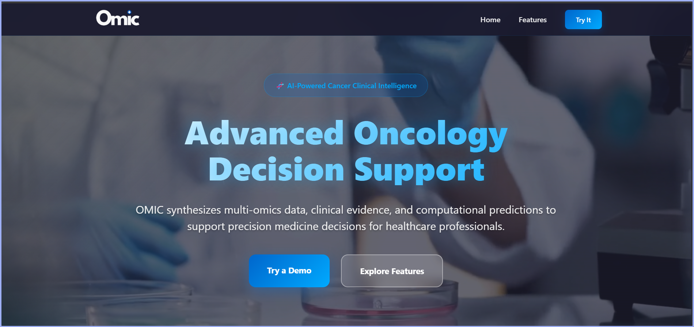

# 🧬 OMIC - Oncology & Medical Innovation Collaborator

**Advanced AI Clinical Decision Support System for Oncology Healthcare Professionals**

OMIC is a specialized AI-powered clinical decision support tool designed to assist oncology healthcare professionals with evidence-based treatment analysis, clinical case evaluation, and medical research insights.

## ⚠️ Important Medical Disclaimer

**OMIC is designed for healthcare professionals only and is intended for educational and decision support purposes. All recommendations must be validated by qualified oncologists. This system does not replace professional medical judgment or direct patient care.**

## 🚀 Features

### Core Capabilities
- **Multi-omics Data Interpretation** - Genomics, proteomics, metabolomics analysis
- **Evidence-Based Treatment Recommendations** - Guidelines-based treatment analysis
- **Clinical Trial Matching** - Eligibility assessment and trial recommendations
- **Drug Interaction Analysis** - Comprehensive contraindication evaluation
- **Prognostic Factor Evaluation** - Risk assessment and outcome prediction
- **Biomarker Interpretation** - Clinical significance and therapeutic implications
- **Personalized Treatment Pathways** - Individualized treatment suggestions
- **Risk Stratification** - Patient-specific risk assessment

### Clinical Framework
1. **Clinical Assessment** - Systematic case analysis
2. **Evidence Review** - Current guidelines (NCCN, ASCO, ESMO) integration
3. **Risk-Benefit Analysis** - Comprehensive treatment option evaluation
4. **Evidence-Based Recommendations** - Confidence-rated suggestions
5. **Monitoring Plans** - Follow-up protocols and tracking parameters
6. **Additional Considerations** - Clinical trials, genetic testing, referrals

## 🛠️ Setup Instructions

### Prerequisites
- Modern web browser (Chrome, Firefox, Safari, Edge)
- Google Gemini API key
- Basic understanding of HTML/JavaScript (for customization)

### Installation Steps

1. **Get Your Gemini API Key**
   - Visit [Google AI Studio](https://aistudio.google.com/)
   - Sign in with your Google account
   - Navigate to "Get API Key"
   - Create a new API key
   - Copy the generated key

2. **Configure the Application**
   - Open the main JavaScript file
   - Locate this line at the top:
     ```javascript
     const API_KEY = ""; // Your Gemini API Key
     ```
   - Replace the empty string with your API key:
     ```javascript
     const API_KEY = "your-gemini-api-key-here";
     ```

3. **Deploy the Application**
   - Upload all files to your web server
   - Or run locally using a local server (e.g., Python's `http.server`, Node.js `http-server`)
   - Access the application through your web browser


## 🔧 Configuration

### API Key Security
**Important**: Never commit your API key to version control or share it publicly.

For production deployments:
- Use environment variables
- Implement server-side API key management
- Consider implementing user authentication

### Customization Options
- Modify the `SYSTEM_PROMPT` to adjust OMIC's behavior
- Update styling in `styles.css` for branding
- Extend functionality by modifying the chat interface

## 💡 Usage Guidelines

### For Healthcare Professionals
1. **Case Presentation**: Provide detailed clinical information
2. **Specific Questions**: Ask targeted questions about treatment options
3. **Evidence Requests**: Request specific guideline references
4. **Risk Assessment**: Inquire about prognostic factors
5. **Trial Matching**: Request clinical trial recommendations

### Example Queries
- "Analyze treatment options for a 65-year-old patient with stage IIIA NSCLC, EGFR wild-type"
- "What are the biomarker implications for this breast cancer case?"
- "Evaluate drug interactions for concurrent chemotherapy and immunotherapy"
- "Assess eligibility for current clinical trials in pancreatic adenocarcinoma"

## 🔐 Safety Protocols

OMIC includes built-in safety measures:
- **Professional Validation Required** - All recommendations require oncologist review
- **Confidence Levels** - Evidence quality ratings provided
- **Limitation Acknowledgment** - Clear uncertainty identification
- **Emergency Flagging** - Immediate attention requirements highlighted
- **Specialist Referral Recommendations** - When additional expertise needed

## 📊 Evidence Sources

OMIC references current clinical guidelines including:
- **NCCN** (National Comprehensive Cancer Network)
- **ASCO** (American Society of Clinical Oncology)
- **ESMO** (European Society for Medical Oncology)
- Current peer-reviewed literature
- FDA-approved treatment protocols

## 🤝 Contributing

This system is designed for healthcare professional use. Contributions should:
- Maintain medical accuracy and safety standards
- Follow evidence-based medicine principles
- Include appropriate medical disclaimers
- Undergo professional medical review

## 📋 Technical Requirements

### Minimum Requirements
- Internet connection for API access
- Modern web browser with JavaScript enabled
- Valid Gemini API key with sufficient quota

### Recommended Specifications
- High-speed internet connection
- Desktop or tablet interface for optimal experience
- Secure network environment for patient data protection

## 🆘 Support & Troubleshooting

### Common Issues
1. **API Key Errors**: Ensure your Gemini API key is correctly configured
2. **Network Issues**: Check internet connectivity and firewall settings
3. **Rate Limiting**: Monitor API usage and consider upgrading your Gemini plan
4. **Browser Compatibility**: Use a modern, updated web browser

### Getting Help
- Check the browser console for error messages
- Verify API key permissions and quota
- Ensure all files are properly deployed
- Test with a simple query first

## ⚖️ Legal & Compliance

### Important Notes
- **Professional Use Only** - Designed for qualified healthcare professionals
- **No Patient Data Storage** - Conversations are not permanently stored
- **HIPAA Considerations** - Ensure compliance with patient privacy regulations
- **Professional Liability** - Healthcare professionals remain responsible for all clinical decisions

### Terms of Use
By using OMIC, you acknowledge:
- You are a qualified healthcare professional
- All recommendations require professional validation
- The system is for decision support only
- You maintain full clinical responsibility

## 📝 License

This project is intended for healthcare professional use. Please ensure compliance with all applicable medical device regulations and professional standards in your jurisdiction.

---

**🧬 OMIC - Enhancing Oncology Care Through AI-Powered Clinical Decision Support**

*Always remember: Technology augments, but never replaces, professional medical judgment.*
